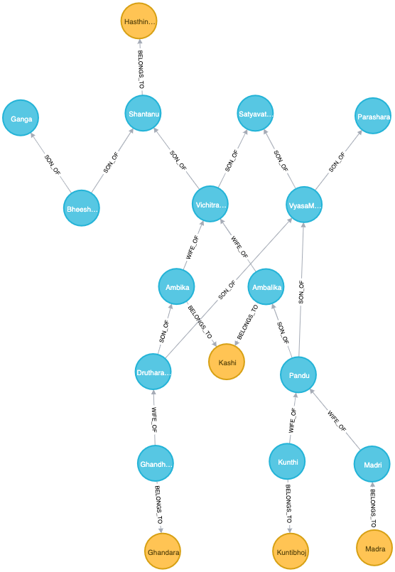

Mahabhart Intro Representation using Neo4j
===========================================

Graph DB
-----------
- Nodes  ()
- Realtionships -[]->

Nodes with labels 
------------------

     :Person  
     :Car
     :Vehicle
 
 Illustration
 --------------

     :Person ---- Owns ---> :Building 
     { 			{ 
       name: "John",	    location:"Chennai",
       dob : 1989
     }			} 

    :Person <- node with label Person
    :Building <- node with lable Building
     name , dob , location <- propeties

Properties dataypes:
--------------------
    Boolean ( true,false)
    Text  - 'Something'
    Number -  ( integer or float ) 1234556.70
    Point	-  ( 4 types ) 2D, 3D, lat long , lat long height
    Temporal - Date, Time, DateTime, LocalTime, LocalDateTime, Duration
    List - ['must','be','of','same','type']

Note:
----- 
-   Neo4j not Support nested properties

-   Schema is Optional

-   Node property uniqueness constraint ( all editions)
-   Node property existence constraints ( Enterprise only)
-   Relationship property existence constraints ( Enterprise only)
-   Node Key constraints ( Enterprise only )

sandbox
-------
    sandbox.neo4j.com
    https://sandbox.neo4j.com/login

local setup:
------------

    localhost:7474

 Run
------

    :sysinfo
    :clear
    :help help
    :help MATCH
    :help keys 
    
    :use system  // switching to system database
    
    show databases 
    create database myMovies
    drop database myMovies
    show all roles 

    cmd + enter

    MATCH (n)
    RETRUN n
    LIMIT 1			// show one node
    
    
    MATCH (n)
    RETURN n        // show all nodes and realtionships
    
    
    
    CALL db.schema.visualization  // show possible nodes and relationships
    
    
    
    CALL db.labels   		    // returns nodes
    CALL db.relationshipTypes   // returns relationships
    
    MATCH (m:Person)		
    RETURN m
    LIMIT 3						// returns Nodes 
    
    
    
    MATCH (m:Person)
    RETURN m.name
    LIMIT 3						// returns Name as table
    
    
    
    MATCH (w:Person)-[:WIFE_OF]->(h:Person)
    //WHERE p.name='Satyavathi'
    RETURN w.name,h.Name     // Returns
    
    w.name 			h.name
    ------			-------
    ganga  			shantanu
    satyavathi 		shantanu

    // create realtionship between nodes
    
    MATCH (a:Person),(k:Kingdom)
    WHERE a.name = 'Shantanu' AND k.name = 'Hastinapura'
    CREATE (a)-[r:RULED]->(b)
    RETURN type(r)

    MATCH (w:Person)-[:WIFE_OF]->(h:Person)-[:RULED]->(k:Kingdom)
    RETURN w.name,h.name,k.name  
    
    w.name	h.name	k.name
    ------  ------- -------
    "Ganga"	       "Shantanu"	"Hastinapura"
    "Satyavathi"	"Shantanu"	"Hastinapura"

    MATCH (w:Person)-[:WIFE_OF]->(h:Person)-[:RULED]->(k:Kingdom)
    //RETURN w.name,h.name,k.name 
    RETURN w,h,k
    
    // return graphical representation as we are returning nodes

    match (n) 
    WHERE NOT (EXISTS (n.name)) 
    DETACH DELETE n               // delete null nodes
    

Editions
--------

    community edition : 34B nodes limitation

MATCH
======
    
    
    MATCH (n) RETURN n     // show all nodes 
    
    MATCH (n) 
    RETURN n 
    LIMIT 10               // show all nodes  limit 10
    
    
    MATCH(p:Person)
    RETURN p
    LIMIT 10;			  // show only nodes with Person label and limit 10 
    
    
    MATCH (n1)--(n2) 
    RETURN n1,n2	
    //LIMIT 1				  // " -- " means any relationship between any 2 nodes